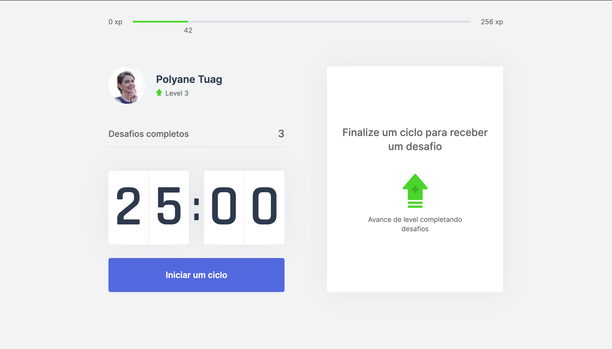
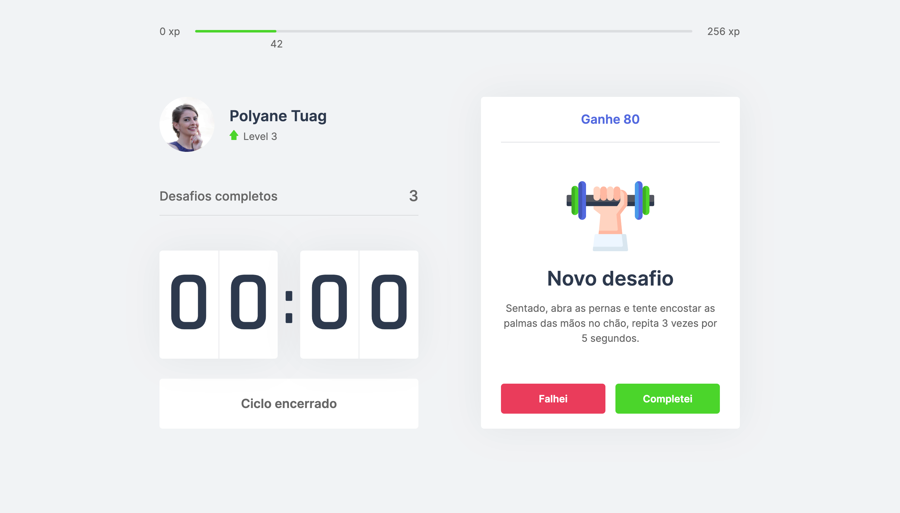
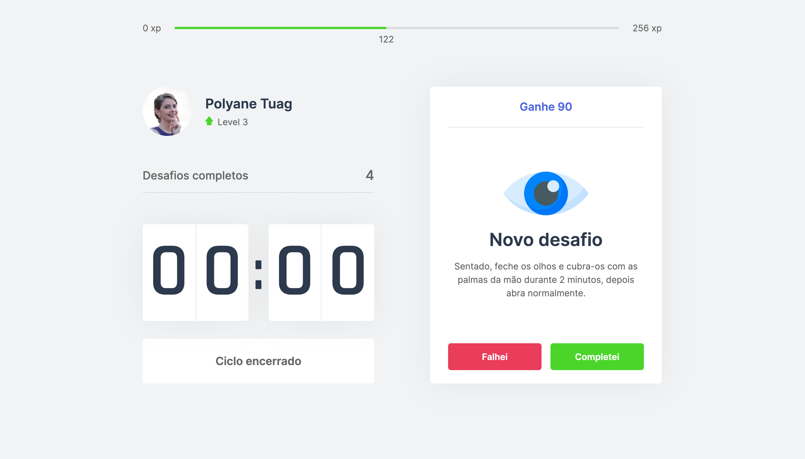
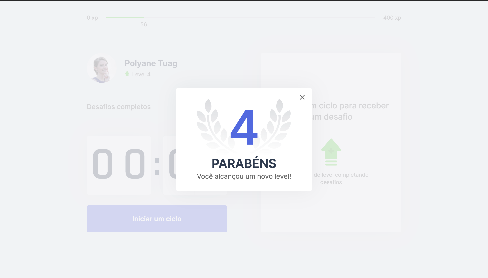

 &nbsp;

<p align="center">
  
</p>

<h3 align="center"> Next Level Week #04</h3>

## 📚 Sobre

Com o intuito de amenizar a ocorrência de doenças causadas pelo uso intensivo de tecnologias, a aplicação ***Move.it*** busca incentivar o exercício do corpo para melhorar diariamente a saúde física e mental. 

A aplicação funciona da mesma forma que o método Pomodoro, em que a cada 25 minutos, há uma pausa para a realização de exercícios que são propostos pela aplicação.

## 💻 Tecnologias Utilizadas

- [ReactJS](https://react.dev/)
- [NextJS](https://nextjs.org/)
- [Typescript](https://www.typescriptlang.org/)
- [NodeJs](https://nodejs.org/pt)


## 🎨 Layouts

<p align="center">
  
</p>
<p align="center">
  
</p>
<p align="center">
  
</p>
<p align="center">
  
</p>

---
## 🪄 Aplicação

Para usar a aplicação, basta clonar o repositório e rodar: 

- Instalar as dependências
  
  ```
    yarn 
  ```
- Iniciar o projeto
  
  ```
    yarn dev
  ```
  ---
## 🗃 Licença
Este projeto está sob a licença do [MIT](https://opensource.org/license/mit).

---
Desenvolvido com 💙 por Polyane Tuag 
