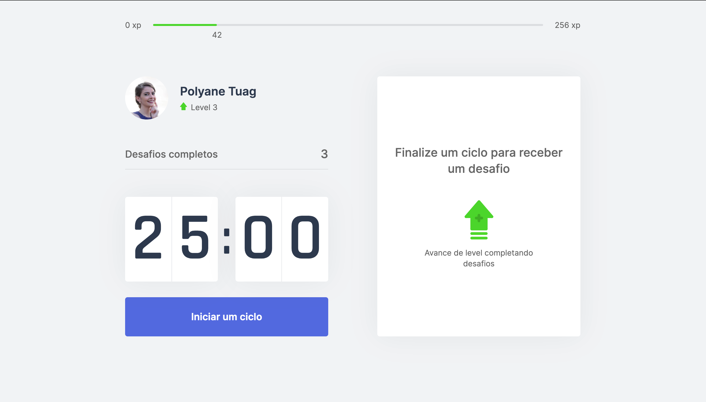
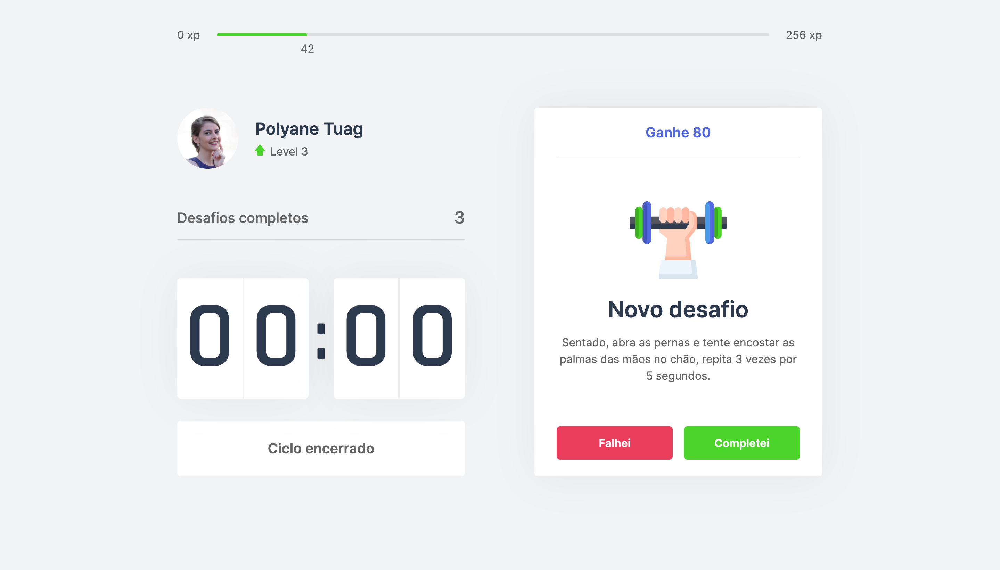
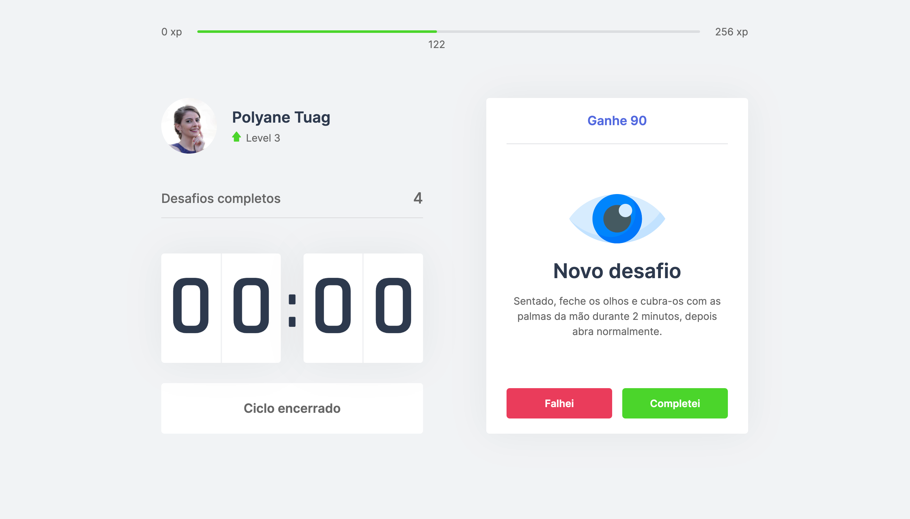
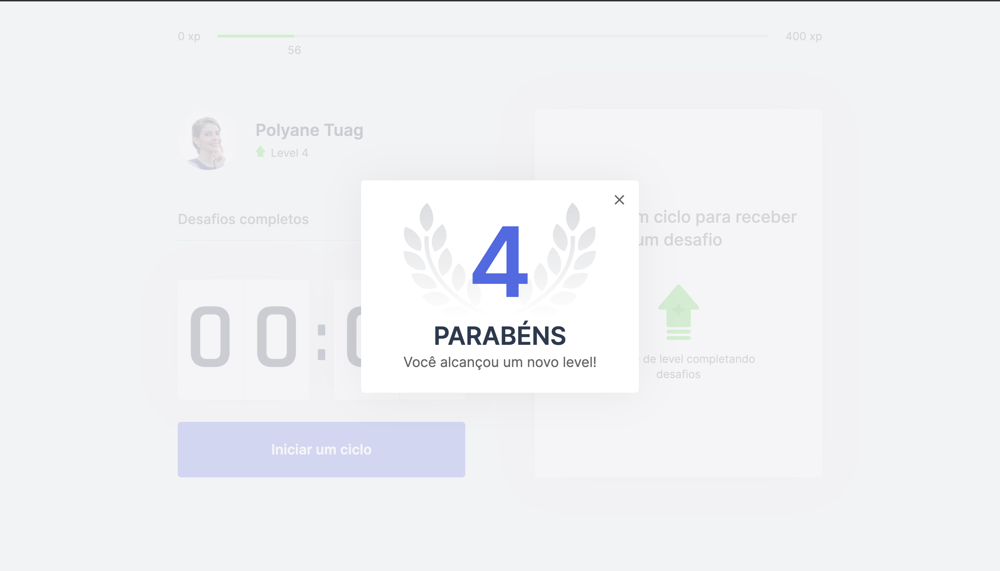

 &nbsp;

<p align="center">
  
</p>

<h3 align="center"> Next Level Week #04</h3>

## 📚 Sobre

Com o intuito de amenizar a ocorrência de doenças causadas pelo uso intensivo das tecnologias, a aplicação ***Move.it*** busca incentivar o exercício do corpo para melhorar diariamente sua saúde física e mental. 

A aplicação funciona da mesma forma que o método *Pomodoro*: a cada 25 minutos, há um timer para realizar uma pausa e fazer os exercícios que são propostos na aplicação.

## 💻 Tecnologias Utilizadas

- [ReactJS](https://react.dev/)
- [NextJS](https://nextjs.org/)
- [Typescript](https://www.typescriptlang.org/)
- [NodeJs](https://nodejs.org/pt)


## 🎨 Layouts

<p align="center">
  
</p>
<p align="center">
  
</p>
<p align="center">
  
</p>
<p align="center">
  
</p>

## 🪄 Aplicação

Para usar a aplicação, basta:

  ```bash
# Clonar o repositório
$ git clone https://github.com/polyanetuag/moveit-next.git

# Entrar na pasta
$ cd moveit-next

# Instalar as dependencias
$ yarn ou npm install

# Iniciar o servidor
$ yarn dev ou npm run dev

```

  
## 🗃 Licença
Este projeto está sob a licença do [MIT](https://opensource.org/license/mit).

---
Desenvolvido com 💙 por Polyane Tuag 
